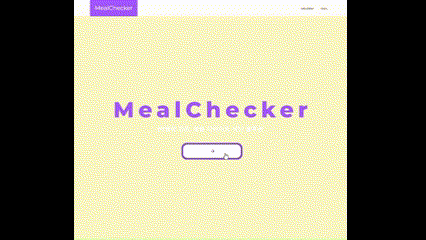
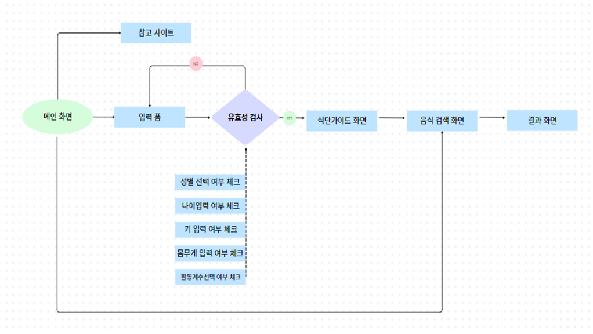

## Meal Checker

## Meal Checker는 식품 공공 데이터를 활용하여 사용자의 식단을 체크할 수 있는 웹 애플리케이션입니다. 이 프로젝트는 건강한 식단 관리를 위해 만들어졌으며, 사용자는 섭취한 음식의 영양 성분을 쉽게 확인할 수 있습니다.

## Features

- **공공 데이터 활용**: 공공 식품 데이터베이스를 사용하여 다양한 음식의 영양 정보를 제공합니다.
- **식단 관리**: 사용자가 섭취한 음식의 영양 성분을 입력하면, 이를 바탕으로 일일 영양소 섭취량을 계산하고 시각화합니다.
- **사용자 친화적 인터페이스**: 직관적인 웹 인터페이스를 통해 쉽게 사용할 수 있습니다.

## Technologies Used

- **HTML**: 구조적인 웹 페이지 마크업을 작성하는 데 사용
- **CSS**: 웹 페이지의 스타일링 및 레이아웃 디자인
- **JavaScript**: 클라이언트 측 로직 및 API 통신
- **Fetch API**: 공공 데이터 포털 API로부터 데이터를 가져오는 데 사용
- **공공 데이터 포털 API**: 식품 영양 성분 데이터를 제공

## 화면흐름도

